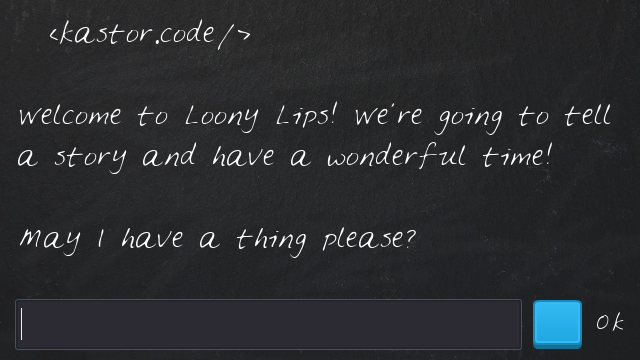
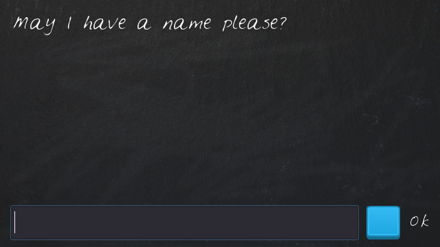
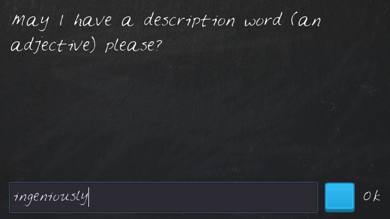
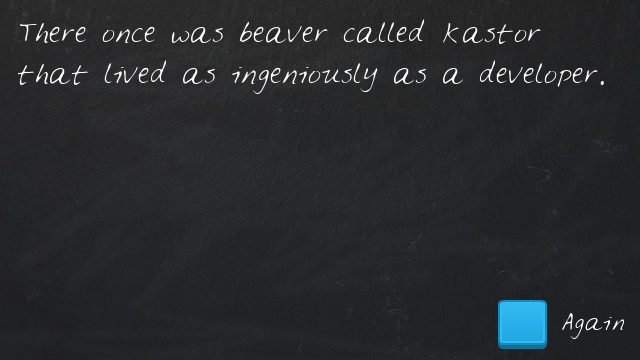

## Loony Lips

> 👷 Developed by Matheus Ramalho de Oliveira.  
🔨 Systems Analyst, Full-Stack Developer.  
🏡 Goiânia, Goiás, Brasil.  
✉️ kastorcode@gmail.com  
👍 [instagram.com/kastorcode](https://www.instagram.com/kastorcode)

---

    

    Don't be like this app, control your tongue!

    First game developed on Godot Engine in Discovering Godot: Make Video Games in Python-like GDScript course.

---

### Screenshots

    

    

    

    

---

### 👅 Installation and execution

1. Make a clone of this repository;
2. Import the project into the [Godot Engine](https://godotengine.org);
3. Press `F5` to start the game;
4. Just that!
